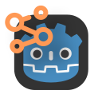
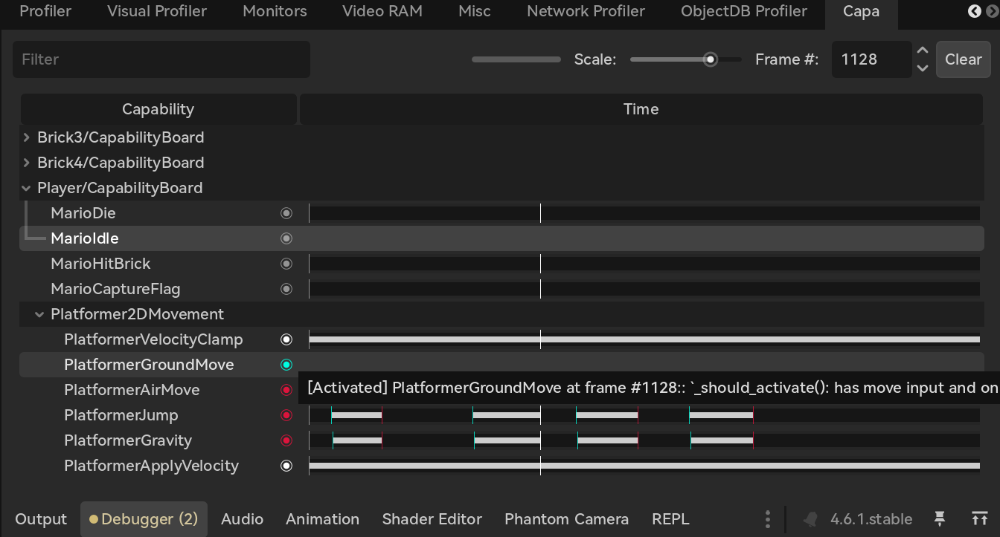

# godot-capa

A Capability-based Gameplay System plugin for Godot. Provides capability-based debugging and auxiliary tools.

## What is a Capability?

Capabilities are a gameplay code organization pattern used by Hazelight Studios during the development of Split Fiction.
Capabilities can be seen as a distant cousin to Systems in ECS, as both are responsible for behavior, but Capabilities are used within a GameObject-Component structure.

For more information, refer to this GDC 2025 talk: https://schedule.gdconf.com/session/capabilities-coding-all-the-gameplay-for-split-fiction/907193

## What does this plugin provide?

Items marked with [x] are completed, and items marked with [ ] are planned.

- [x] Basic implementation of the Capability system in Godot

- [x] Runtime debugger for the Capability system

- [ ] Implementation and debugging tools for Capabilities in networked games

